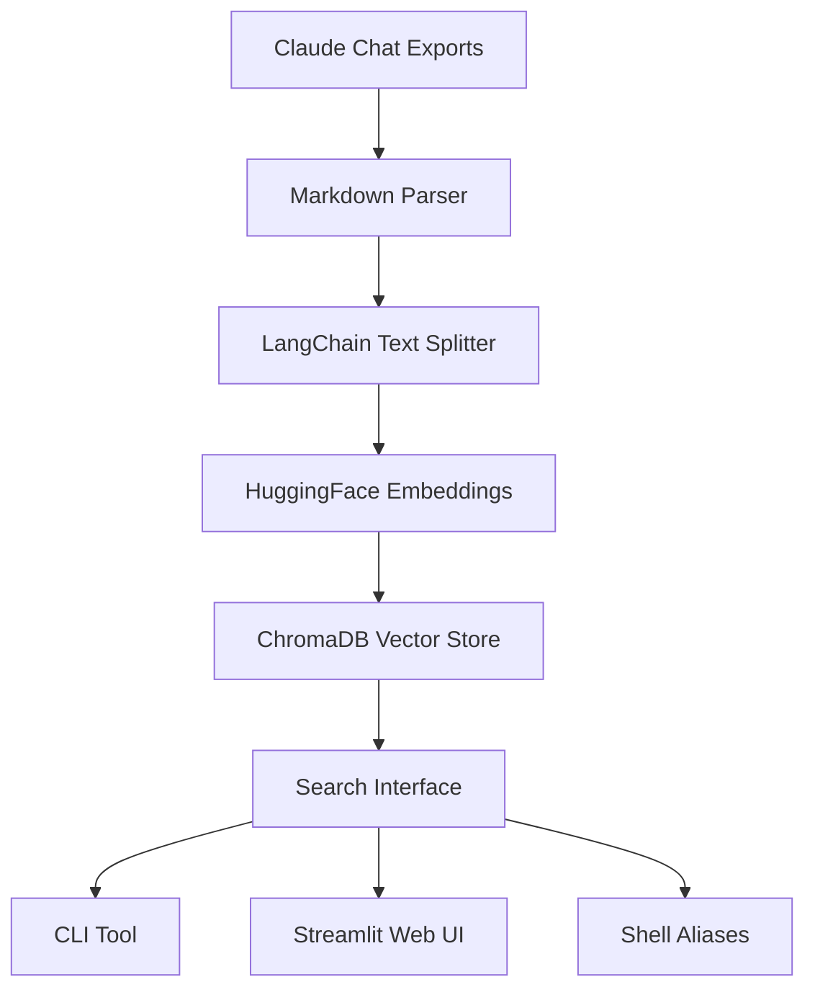

# 🧠 Claude RAG Memory Search

**Give Claude ChatGPT-style memory** - Search through your conversation history with semantic AI search! ✨

[](https://python.org)
[](https://langchain.com)
[](https://chromadb.ai)
[](https://streamlit.io)

## 🎯 Problem Solved

**The Issue:** Claude forgets everything between conversations. You lose valuable insights, code examples, and advice.

**The Solution:** Local RAG system that gives Claude persistent memory by searching your chat history.

## ✨ Features

- 🔍 **Semantic Search** - Find conversations by meaning, not just keywords
- 💬 **Chat Parsing** - Automatically processes Claude Desktop exports  
- 🌐 **Web UI** - Beautiful Streamlit interface for browsing
- 💻 **CLI Tools** - Terminal-friendly search commands
- 🔒 **100% Local** - Your data never leaves your machine
- ⚡ **Fast Setup** - One-click installation script

## 🚀 Quick Start

### 1. Clone & Setup
```bash
git clone https://github.com/anix-lynch/claude-rag-memory-search.git
cd claude-rag-memory-search
./setup.sh
```

### 2. Add Your Conversations
```bash
# Export your Claude chats as .md files to the vault/ directory
cp /path/to/claude-export.md vault/

# Index your conversations
python src/index_conversations.py
```

### 3. Search!
```bash
# CLI search
python src/search.py "python web scraping tips"

# Web UI
streamlit run src/app.py
# Opens: http://localhost:8501
```

## 🎯 Architecture



## 🛠️ Tech Stack

| Component | Technology | Purpose |
|-----------|------------|---------|
| **Vector DB** | ChromaDB | Semantic similarity search |
| **Embeddings** | sentence-transformers | Text → vector conversion |
| **RAG Framework** | LangChain | Document processing pipeline |
| **Frontend** | Streamlit | Web interface |
| **CLI** | Python + argparse | Terminal tools |
| **Storage** | Local filesystem | Privacy-first data storage |

## 🧪 Use Cases

**For Developers:**
- 🚀 "What libraries did Claude recommend for my project?"
- 🐛 "How did Claude suggest fixing that bug last month?"
- 📚 "Find all the learning resources Claude shared"

**For Researchers:**
- 📈 "What analysis techniques did we discuss?"
- 📊 "Find conversations about data visualization"
- 🧪 "Retrieve methodology recommendations"

**For Content Creators:**
- ✍️ "What writing tips did Claude give me?"
- 🎨 "Find creative project ideas we brainstormed"
- 📱 "Search social media strategy discussions"

## 📊 Sample Searches

```bash
# Find coding help
python src/search.py "debugging React components"

# Get career advice
python src/search.py "interview preparation tips"

# Retrieve project ideas
python src/search.py "side project suggestions"

# Search for specific tools
python src/search.py "best VS Code extensions"
```

## 🚀 Performance

- **Index Speed:** ~1,000 conversation chunks/minute
- **Search Speed:** <100ms for semantic queries
- **Storage:** ~1MB per 100 conversations
- **Memory Usage:** <500MB during operation

## 🎨 Screenshots

### CLI Search Interface
*Fast terminal-based search with rich output*

### Streamlit Web UI
*Beautiful web interface for visual browsing*

### Search Results
*Semantic similarity with relevance scoring*

## 🔧 Advanced Configuration

### Custom Embedding Models
```python
# config.py
EMBEDDING_MODEL = "all-MiniLM-L6-v2"  # Fast, good quality
# EMBEDDING_MODEL = "all-mpnet-base-v2"  # Slower, better quality
```

### Search Parameters
```python
# Adjust search sensitivity
results = search(
    query="your search",
    top_k=5,           # Number of results
    similarity_threshold=0.7  # Minimum relevance
)
```

## 🤝 Contributing

Contributions welcome! Areas for improvement:

- [ ] **Additional export formats** (JSON, HTML)
- [ ] **Conversation threading** (link related chats)
- [ ] **Advanced filters** (date, topic, speaker)
- [ ] **Export tools** (PDF summaries, mind maps)
- [ ] **Browser extension** (search from Claude UI)

## 📄 License

MIT License - Feel free to use this for personal or commercial projects!

## 👤 Author

**Built by Anix Lynch** - AI Engineer & Full-Stack Developer

- 🐦 Twitter: [@anixlynch](https://twitter.com/anixlynch)
- 💼 LinkedIn: [linkedin.com/in/anixlynch](https://www.linkedin.com/in/anixlynch/)
- 📁 Portfolio: [gozeroshot.dev](https://www.gozeroshot.dev)
- 💻 GitHub: [github.com/anix-lynch](https://github.com/anix-lynch)
- 📊 Kaggle: [kaggle.com/anixlynch](https://www.kaggle.com/anixlynch)

---

### 🎆 Why This Project Matters

**AI memory is the future.** While ChatGPT has persistent memory, Claude users were left behind. This project **bridges that gap** with a local-first solution that:

✅ **Preserves privacy** (your data stays local)  
✅ **Works offline** (no API dependencies)  
✅ **Scales infinitely** (process thousands of conversations)  
✅ **Integrates seamlessly** (CLI + Web + Shell aliases)  

**This is the kind of practical AI tooling that makes developers 10x more productive.** ✨

---

*Star ⭐ this repo if it helped you! Issues and PRs are welcome.* 💬